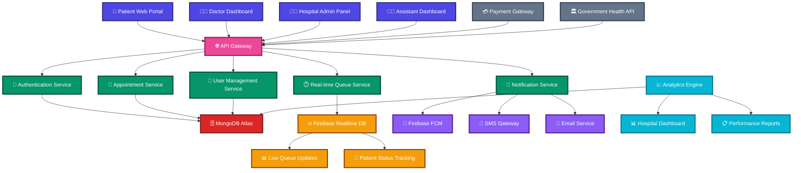

<h1 align="center">🏥 Hospital Management System</h1>

## *Revolutionizing Healthcare in India*
  
### 🚀 Eliminating Long Queues with Smart Digital Solutions

<div align="center">

[](https://github.com/team27)
[](https://github.com/team27/hms)
[](https://github.com/team27/hms)
[](#license)

</div>

---

<div align="center">

### 🌟 **Transforming Healthcare Experience**
*Building the future of medical management with cutting-edge technology*

</div>

<br>

<div align="center">

</div>

---


## 📋 **Table of Contents**

- [🎯 Problem Statement](#-problem-statement)
- [💡 Solution Overview](#-solution-overview)
- [🏗️ System Architecture](#️-system-architecture)
- [🔌 API Routes & Endpoints](#-api-routes--endpoints)
- [📱 Technology Stack](#-technology-stack)
- [📂 Project Structure](#-project-structure)
- [🔔 Real-time Features](#-real-time-features)
- [🚀 Getting Started](#-getting-started)
- [📊 Impact & Analytics](#-impact--analytics)

---

## 🎯 **Problem Statement**

### **Current Healthcare Crisis in India**

India's healthcare system faces critical challenges that directly impact patient lives:

#### 📈 **Alarming Statistics**
- **1.6 million Indians** died in 2016 due to poor quality care and management *(The Lancet)*
- **75% of cancer deaths** at AIIMS Delhi are attributed to long waiting times
- **10,000+ OPD patients** daily at AIIMS with many turned away

#### 🚨 **Critical Issues**

| Issue | Impact | Consequence |
|-------|--------|-------------|
| **Excessive Queuing** | 3-8 hours wait time | Patient mortality, delayed treatment |
| **Disease Spread** | Crowded waiting areas | TB, COVID-19, Influenza transmission |
| **Staff Overload** | Unmanaged crowds | Reduced care quality |
| **Manual Processes** | Paper-based systems | Appointment conflicts, confusion |

#### 📰 **Real Cases**
- Mumbai Hospital Staff Dies After 3-Hour Wait
- Man Dies Waiting for Ultrasound at Noida Hospital
- COVID Patient Dies Outside Thane Hospital Waiting for ICU
- Patient Dies After 3-Hour Queue Wait in Kolkata

---

## 💡 **Solution Overview**

### 🩺 **For Doctors**
```
✅ Real-time appointment dashboard
✅ Smart patient flow management
✅ Automated arrival notifications
✅ Queue status updates
✅ One-click patient communication
```

### 🏥 **For Patients**
```
✅ Online appointment booking
✅ Real-time queue tracking (like Uber/Ola)
✅ SMS & push notifications
✅ Estimated wait times
✅ Just-in-time arrival alerts
✅ Reduced exposure to crowds
```

### 👨‍💼 **For Hospital Staff**
```
✅ Centralized patient management
✅ Digital workflow automation
✅ Real-time analytics
✅ Staff coordination tools
✅ Resource optimization
```

---

## 🏗️ **System Architecture**



---

## 🔌 **API Routes & Endpoints**

### 🔐 **Authentication Module**

| Method | Endpoint | Description | Request Body | Response |
|--------|----------|-------------|--------------|----------|
| `POST` | `/api/auth/register` | Register new user | `{email, password, phone}` | `{token, user}` |
| `POST` | `/api/auth/login` | User login | `{email, password}` | `{token, user, role}` |
| `PATCH` | `/api/auth/select-role` | Assign user role | `{role, hospitalId?}` | `{user, role}` |
| `POST` | `/api/auth/forgot-password` | Reset password | `{email}` | `{message}` |
| `POST` | `/api/auth/verify-otp` | Verify OTP | `{phone, otp}` | `{verified}` |

---

### 👤 **Patient Module**

#### **Dashboard & Profile**
| Method | Endpoint | Description | Auth Required |
|--------|----------|-------------|---------------|
| `GET` | `/api/patient/dashboard` | Patient overview | ✅ |
| `GET` | `/api/patient/profile` | Get patient profile | ✅ |
| `PUT` | `/api/patient/profile` | Update profile | ✅ |
| `POST` | `/api/patient/upload-documents` | Upload medical docs | ✅ |

#### **Appointments**
| Method | Endpoint | Description | Request Body |
|--------|----------|-------------|--------------|
| `POST` | `/api/patient/book-appointment` | Book doctor appointment | `{doctorId, date, timeSlot, symptoms}` |
| `POST` | `/api/patient/book-lab` | Book lab test | `{labId, testType, date, timeSlot}` |
| `GET` | `/api/patient/appointments` | Get all appointments | - |
| `GET` | `/api/patient/appointments/:id` | Get specific appointment | - |
| `PATCH` | `/api/patient/appointments/:id/cancel` | Cancel appointment | `{reason}` |
| `PATCH` | `/api/patient/appointments/:id/reschedule` | Reschedule appointment | `{newDate, newTimeSlot}` |

#### **Medical Records**
| Method | Endpoint | Description |
|--------|----------|-------------|
| `GET` | `/api/patient/medical-history` | Complete medical history |
| `GET` | `/api/patient/prescriptions` | All prescriptions |
| `GET` | `/api/patient/lab-reports` | Lab test reports |
| `GET` | `/api/patient/upcoming-appointments` | Next appointments |

#### **Family Management**
| Method | Endpoint | Description | Request Body |
|--------|----------|-------------|--------------|
| `POST` | `/api/patient/family/add` | Add family member | `{name, relation, phone, dob}` |
| `GET` | `/api/patient/family` | Get family members | - |
| `PUT` | `/api/patient/family/:id` | Update family member | `{name, phone, relation}` |
| `DELETE` | `/api/patient/family/:id` | Remove family member | - |

---

### 👨‍⚕️ **Doctor Module**

#### **Dashboard & Schedule**
| Method | Endpoint | Description |
|--------|----------|-------------|
| `GET` | `/api/doctor/dashboard` | Today's overview |
| `GET` | `/api/doctor/schedule` | Weekly schedule |
| `PUT` | `/api/doctor/schedule` | Update availability |
| `GET` | `/api/doctor/queue` | Current patient queue |

#### **Patient Management**
| Method | Endpoint | Description | Request Body |
|--------|----------|-------------|--------------|
| `GET` | `/api/doctor/patients/today` | Today's patients | - |
| `GET` | `/api/doctor/patients/:id` | Patient details | - |
| `GET` | `/api/doctor/patients/:id/history` | Patient medical history | - |
| `POST` | `/api/doctor/patients/:id/prescription` | Add prescription | `{medicines, instructions, followUp}` |
| `POST` | `/api/doctor/patients/:id/lab-request` | Request lab tests | `{tests, priority, instructions}` |

#### **Consultation**
| Method | Endpoint | Description | Request Body |
|--------|----------|-------------|--------------|
| `PATCH` | `/api/doctor/consultation/:id/start` | Start consultation | - |
| `PATCH` | `/api/doctor/consultation/:id/complete` | Complete consultation | `{diagnosis, prescription, notes}` |
| `POST` | `/api/doctor/consultation/:id/notes` | Add consultation notes | `{notes, symptoms, diagnosis}` |

---

### 🏥 **Hospital Admin Module**

#### **Dashboard & Analytics**
| Method | Endpoint | Description |
|--------|----------|-------------|
| `GET` | `/api/hospital/dashboard` | Hospital overview |
| `GET` | `/api/hospital/analytics` | Performance metrics |
| `GET` | `/api/hospital/reports` | Monthly reports |

---

### 🧪 **Lab Module**

#### **Lab Management**
| Method | Endpoint | Description | Request Body |
|--------|----------|-------------|--------------|
| `GET` | `/api/lab/dashboard` | Lab overview | - |
| `GET` | `/api/lab/appointments` | Today's appointments | - |
| `PATCH` | `/api/lab/appointments/:id/status` | Update test status | `{status, notes}` |
| `POST` | `/api/lab/reports/:id/upload` | Upload test results | `{reportFile, results, notes}` |

#### **Test Management**
| Method | Endpoint | Description | Request Body |
|--------|----------|-------------|--------------|
| `GET` | `/api/lab/tests` | Available tests | - |
| `POST` | `/api/lab/tests` | Add new test | `{name, price, duration, instructions}` |
| `PUT` | `/api/lab/tests/:id` | Update test info | `{price, duration, instructions}` |

---

### 👨‍💼 **Assistant Module**

#### **Queue Management**
| Method | Endpoint | Description | Request Body |
|--------|----------|-------------|--------------|
| `GET` | `/api/assistant/queue` | Current queue status | - |
| `POST` | `/api/assistant/checkin/:appointmentId` | Check-in patient | - |
| `PATCH` | `/api/assistant/queue/:id/next` | Call next patient | - |
| `POST` | `/api/assistant/notify` | Send custom notification | `{patientId, message, type}` |

#### **Patient Flow**
| Method | Endpoint | Description | Request Body |
|--------|----------|-------------|--------------|
| `GET` | `/api/assistant/patients/waiting` | Waiting patients | - |
| `PATCH` | `/api/assistant/patients/:id/status` | Update patient status | `{status, notes}` |
| `POST` | `/api/assistant/delay` | Announce delay | `{delayMinutes, reason}` |

---

### 🔔 **Notification Module**

| Method | Endpoint | Description | Request Body |
|--------|----------|-------------|--------------|
| `POST` | `/api/notifications/send` | Send notification | `{userId, message, type}` |
| `GET` | `/api/notifications/:userId` | Get user notifications | - |
| `PATCH` | `/api/notifications/:id/read` | Mark as read | - |
| `POST` | `/api/notifications/broadcast` | Broadcast message | `{message, userType, hospitalId}` |

---

## 📱 **Technology Stack**

### **Frontend Technologies**
```javascript
{
  "framework": "React.js 18+",
  "styling": "Tailwind CSS",
  "stateManagement": "Redux Toolkit",
  "routing": "React Router v6",
  "httpClient": "Axios",
  "uiComponents": "ShadCn + magic + acertinity UI",
  "charts": "Chart.js / Recharts",
  "notifications": "React Hot Toast"
}
```

### **Backend Technologies**
```javascript
{
  "runtime": "Node.js 18+",
  "framework": "Express.js",
  "authentication": "JWT + bcrypt",
  "validation": "Joi / Zod",
  "fileUpload": "Multer",
  "cors": "CORS middleware",
  "rateLimiting": "express-rate-limit"
}
```

### **Database & Storage**
```javascript
{
  "primaryDB": "MongoDB Atlas",
  "realtimeDB": "Firebase Realtime Database",
  "fileStorage": "Cloudinary",
  "caching": "Redis",
  "search": "MongoDB Atlas Search"
}
```

### **DevOps & Deployment**
```javascript
{
  "containerization": "Docker",
  "deployment": "Vercel / Netlify",
  "apiDeployment": "Railway / Render",
  "monitoring": "Sentry",
  "analytics": "Google Analytics"
}
```

---

## 📂 **Enhanced Project Structure**

```
📦 hospital-management-system/
├── 📁 client/                          # Frontend React Application
│   ├── 📁 public/
│   │   ├── favicon.ico
│   │   └── index.html
│   ├── 📁 src/
│   │   ├── 📁 components/              # Reusable Components
│   │   │   ├── Header.jsx
│   │   │   ├── Sidebar.jsx
│   │   │   ├── LoadingSpinner.jsx
│   │   │   └── AppointmentForm.jsx
│   │   ├── 📁 pages/                   # Main Pages
│   │   │   ├── 📁 auth/
│   │   │   │   ├── Login.jsx
│   │   │   │   └── Register.jsx
│   │   │   ├── 📁 patient/
│   │   │   │   ├── Dashboard.jsx
│   │   │   │   ├── BookAppointment.jsx
│   │   │   │   └── Appointments.jsx
│   │   │   ├── 📁 doctor/
│   │   │   │   ├── Dashboard.jsx
│   │   │   │   ├── Queue.jsx
│   │   │   │   └── PatientDetails.jsx
│   │   │   └── 📁 admin/
│   │   │       ├── Dashboard.jsx
│   │   │       └── ManageStaff.jsx
│   │   ├── 📁 services/                # API Services
│   │   │   ├── api.js
│   │   │   ├── authService.js
│   │   │   └── appointmentService.js
│   │   ├── 📁 utils/                   # Utility Functions
│   │   │   ├── constants.js
│   │   │   └── helpers.js
│   │   ├── App.jsx
│   │   └── index.js
│   ├── package.json
│   └── tailwind.config.js
│
├── 📁 server/                          # Backend Node.js Application
│   ├── 📁 config/                      # Configuration
│   │   ├── database.js
│   │   └── firebase.js
│   ├── 📁 controllers/                 # Route Controllers
│   │   ├── authController.js
│   │   ├── patientController.js
│   │   ├── doctorController.js
│   │   └── adminController.js
│   ├── 📁 middleware/                  # Middleware
│   │   ├── auth.js
│   │   └── validation.js
│   ├── 📁 models/                      # Database Models
│   │   ├── User.js
│   │   ├── Patient.js
│   │   ├── Doctor.js
│   │   └── Appointment.js
│   ├── 📁 routes/                      # API Routes
│   │   ├── auth.js
│   │   ├── patient.js
│   │   ├── doctor.js
│   │   └── admin.js
│   ├── app.js
│   ├── server.js
│   └── package.json
│
├── .env.example
├── .gitignore
├── README.md
└── package.json
```

## 🔔 **Real-time Features & Notifications**

### **Firebase Cloud Messaging (FCM) Events**

| Event Type | Trigger | Recipients | Message Template |
|------------|---------|------------|------------------|
| **Doctor Arrival** | Assistant check-in | Waiting patients | "🩺 Dr. {name} has arrived. Your estimated wait: {time} mins" |
| **You're Next** | Queue management | Next patient | "🔔 You're next! Please proceed to Room {number}" |
| **Appointment Reminder** | 30 mins before | Patient | "⏰ Reminder: Appointment with Dr. {name} at {time}" |
| **Queue Update** | Real-time | All waiting | "📊 Queue Update: {position} people ahead of you" |
| **Delay Notification** | Doctor/Staff | Affected patients | "⏳ Delay Alert: Dr. {name} is running {mins} minutes late" |
| **Report Ready** | Lab upload | Patient | "📋 Your test results are ready for download" |
| **Prescription** | Doctor | Patient | "💊 New prescription available from Dr. {name}" |


## 📊 **Impact & Analytics**

### **Expected Outcomes**

| Metric | Current State | Target Improvement |
|--------|---------------|-------------------|
| **Average Wait Time** | 3-8 hours | 15-30 minutes |
| **Patient Satisfaction** | 40% | 85%+ |
| **Doctor Efficiency** | 60% | 90%+ |
| **Disease Transmission Risk** | High | 70% reduction |
| **Administrative Cost** | 100% | 40% reduction |
| **No-show Rate** | 30% | 10% |


<div align="center">

**🏥 Building a Healthier Tomorrow, One Queue at a Time 🏥**

*Made with ❤️ by HomoSapiens*

</div>
